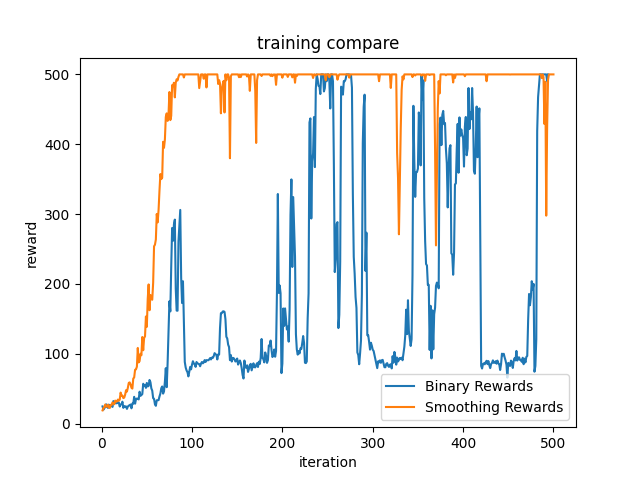

DEEP Q-NET

个人学习研究使用

https://www.bilibili.com/video/BV1hF411L7qu/?spm_id_from=333.788.player.switch&vd_source=b021b63770a534d75991baef118fab6a

以CartPole-v1为例，优化reward，使reward是小车位置及木棍角度的函数，寻找到更优策略。训练效果对比如下

